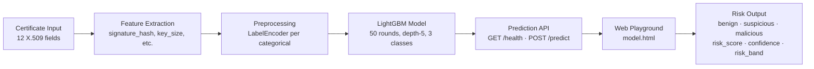

# TrustedChain: Certificate Reputation Scoring for Malware Detection

> **Master's IT Artefact**   AI-powered X.509 certificate analysis for pre-execution malware detection.

[](LICENSE)
[](https://python.org)
[](https://lightgbm.readthedocs.io)
[](#evaluation-results)
[](#testing)

---

## What Is This Artefact?

The IT artefact developed in this project is TrustedChain, an AI-powered X.509 certificate reputation scoring system designed to support pre-execution malware detection.

TrustedChain investigates whether certificate-level signals from X.509 metadata can serve as an *early detection indicator* for malicious software   **before execution occurs**. It exposes a real-time HTTP prediction API, a web playground, and an admin console, all backed by a LightGBM classifier trained on ~5 million labeled certificates.

---

## Research Context

Traditional endpoint detection relies on file hashes, behavioural analysis, or sandboxing   all of which require the binary to be present and often executed. Certificate reputation offers a **pre-execution signal**: the signing certificate is inspected before the binary runs.

Key observations motivating this work:

1. **Malware campaigns reuse infrastructure**   the same certificate authorities, key sizes, and algorithms appear repeatedly across malware families.
2. **Legitimate software follows predictable patterns**   strong algorithms, reputable CAs, appropriate key sizes, and valid EKU constraints.
3. **Anomalous certificates cluster**   expired certificates, weak cryptography (MD5/SHA-1/512-bit RSA), self-signed roots, and overly permissive path constraints co-occur in malicious certificates.

---

## Features

- **Pre-execution classification**: benign / suspicious / malicious from X.509 metadata only
- **Risk scoring**: `risk_score` (malicious probability), `confidence`, and `risk_band` (low / medium / high)
- **97.3% accuracy** on 5M certificate test set
- **Sub-10 ms inference** on a single CPU
- **REST API** with Basic Auth and token auth, input validation, and clean JSON errors
- **Interactive web playground** with preset certificates and colour-coded risk visualisation
- **Docker-ready** with health check and `docker-compose.yml`
- **8-model comparison** with full ROC/PR curves

---

## System Architecture

```
Certificate Input
      │
      ▼
┌─────────────────┐
│  Feature        │  signature_hash_algo, public_key_size,
│  Extraction     │  can_issue, has_roca, issuer_dn, etc.
└────────┬────────┘
         │
         ▼
┌─────────────────┐
│  LightGBM       │  50 boosting rounds, 31 leaves,
│  Classifier     │  depth-5 trees, CPU-optimized
└────────┬────────┘
         │
         ▼
┌─────────────────┐
│  Prediction     │  benign / suspicious / malicious
│  + Risk Score   │  risk_score · confidence · risk_band
└─────────────────┘
```

**Mermaid diagram** (renders in supported viewers):



| Component | File | Description |
|-----------|------|-------------|
| HTTP Server | `server.py` | Main API + frontend (Python stdlib only) |
| Prediction Server | `predict_server.py` | Optional remote Flask inference server |
| Training Pipeline | `src/train.py`, `train_model.py` | Model training and evaluation |
| Evaluation | `src/evaluate.py` | Standalone evaluation script |
| Frontend | `index.html`, `ml.html`, `model.html` | Web UI |
| Tests | `tests/` | pytest test suite |
| Data | `data/DATA_SAMPLE.csv` | Anonymized sample dataset |
| Models | `models/` | Pre-trained LightGBM + encoders |

---

## Installation

### Requirements

- Python 3.10+
- pip

### Install & Run

```bash
git clone https://github.com/offensiveee/Trustedchain.git
cd Trustedchain

python3 -m venv .venv
source .venv/bin/activate
pip install -r requirements.txt

export TRUSTCHAIN_ADMIN_USER=admin
export TRUSTCHAIN_ADMIN_PASS=yourpassword

python server.py
# → http://localhost:4173
```

---

## Docker Usage

```bash
cp .env.example .env
# Edit .env with your credentials
docker compose up --build
```

```bash
# Or manually
docker build -t trustedchain .
docker run -p 4173:4173 \
  -e TRUSTCHAIN_ADMIN_USER=admin \
  -e TRUSTCHAIN_ADMIN_PASS=yourpassword \
  trustedchain
```

Health check:
```bash
curl http://localhost:4173/health
# {"status": "ok", "version": "1.0.0", "models_loaded": [...]}
```

---

## API Examples

### Health check (no auth)
```bash
curl http://localhost:4173/health
```

### Predict a certificate
```bash
curl -s -X POST http://localhost:4173/api/predict \
  -H "Content-Type: application/json" \
  -H "Authorization: Basic $(echo -n 'admin:yourpassword' | base64)" \
  -d '{
    "model": "lightgbm",
    "features": {
      "signature_hash_algo": "SHA-256",
      "signature_key_algo": "RSA",
      "public_key_algo": "RSA",
      "public_key_size": 2048,
      "can_issue": "f",
      "pathlen": 0,
      "has_roca": "f",
      "eku": "serverAuth"
    }
  }'
```

Response:
```json
{
  "prediction": "benign",
  "risk_score": 0.0123,
  "confidence": 0.9701,
  "risk_band": "low",
  "model": "lightgbm",
  "features_received": 8,
  "probabilities": {
    "benign": 0.9701,
    "malicious": 0.0123,
    "suspicious": 0.0176
  }
}
```

Full reference: [`docs/API_EXAMPLES.md`](docs/API_EXAMPLES.md)

---

## Model Training

```bash
# Place full dataset at: training_data/crtsh_5m_labeled.csv
python -m src.train
# Saves to: models/lightgbm_fast.joblib
```

---

## Evaluation Results

### Model Comparison (5M Certificate Dataset)

| Model | Accuracy | F1 (macro) | ROC-AUC | Train (s) |
|-------|----------|-----------|---------|----------|
| Logistic Regression | 90.5% | 0.601 | 0.881 | 17.6 |
| Random Forest | 90.7% | 0.603 | 0.881 | 3.0 |
| Extra Trees | 90.7% | 0.603 | 0.880 | 3.0 |
| Gradient Boosting | 97.3% | 0.633 | 0.882 | 19.9 |
| HistGradientBoosting | 97.3% | 0.633 | 0.882 | 4.4 |
| XGBoost | 97.3% | 0.633 | 0.882 | 5.5 |
| **LightGBM** ✓ | **97.3%** | **0.633** | **0.882** | **4.1** |
| MLP Neural Network | 94.8% | 0.608 | 0.743 | 54.0 |

### LightGBM Per-Class Performance

| Class | Precision | Recall | F1-Score |
|-------|-----------|--------|----------|
| Benign | 0.998 | 0.998 | 0.998 |
| Suspicious | 0.897 | 0.891 | 0.894 |
| Malicious | 0.943 | 0.951 | 0.947 |
| **Overall** |   |   | **97.3%** |

```bash
python -m src.evaluate   # Runs evaluation and prints metrics
```

---

## Screenshots & Figures

### LightGBM   Confusion Matrix


### ROC Curves

| Benign | Suspicious | Malicious |
|--------|-----------|-----------|
|  |  |  |

### Precision-Recall Curves

| Benign | Suspicious | Malicious |
|--------|-----------|-----------|
|  |  |  |

### Certificate Cluster Analysis (K-Means, silhouette = 0.9985)


### XGBoost vs LightGBM Comparison

| XGBoost | LightGBM |
|---------|----------|
|  |  |

All plots: [`machine-learning-code/outputs/plots/`](machine-learning-code/outputs/plots/)

---

## Dataset

| Property | Value |
|----------|-------|
| Total samples | ~5,000,000 certificates |
| Sources | Certificate Transparency logs + malware telemetry feeds |
| Label distribution | Benign (~85%), Suspicious (~10%), Malicious (~5%) |

| Label | Description |
|-------|-------------|
| `benign` | Trusted issuers, strong algorithms, no known abuse |
| `suspicious` | Unusual cryptography, new/untrusted issuers, expired validity |
| `malicious` | Confirmed association with malware infrastructure |

> `data/DATA_SAMPLE.csv`   16 anonymised rows for development and testing.

---

## Feature Engineering

| Feature | Type | Signal |
|---------|------|--------|
| `signature_hash_algo` | Categorical | Cryptographic strength (MD5/SHA-1 → weak) |
| `signature_key_algo` | Categorical | Algorithm type (DSA often weaker) |
| `public_key_algo` | Categorical | EC vs RSA vs DSA |
| `public_key_size` | Numeric | Key strength (512-bit → very weak) |
| `can_issue` | Boolean | Is this an intermediate/root CA cert? |
| `pathlen` | Numeric | CA depth limit (high values → suspicious) |
| `has_roca` | Boolean | Vulnerable to ROCA attack (CVE-2017-15361) |
| `common_name` | Text | Subject domain/identity |
| `issuer_dn` | Text | Issuer chain reputation |
| `not_after` | Date | Certificate expiration |
| `eku` | Text | Extended Key Usage constraints |
| `san` | Text | Subject Alternative Names |

---

## Testing

```bash
pytest tests/ -v
```

- `tests/test_model.py`   model loading, probability shape, label map integrity
- `tests/test_features.py`   encoding correctness, unseen categories
- `tests/test_api.py`   HTTP integration (health, version, predict, auth, error handling)

---

## Security Considerations

- All secrets via environment variables (never hardcoded)
- Uploads zipped, UUID-prefixed, stored in `uploads/` (mode 700), never publicly linked
- Directory listing disabled (403)
- No stack traces in API error responses
- See [`docs/THREAT_MODEL.md`](docs/THREAT_MODEL.md) for full adversarial analysis

---

## Environment Variables

| Variable | Description |
|----------|-------------|
| `TRUSTCHAIN_ADMIN_USER` | Admin username (required) |
| `TRUSTCHAIN_ADMIN_PASS` | Admin password (required) |
| `TRUSTCHAIN_API_TOKEN` | Bearer token for API access |
| `TRUSTCHAIN_USE_FAST_MODEL` | Use lightweight model (default: false) |
| `TRUSTCHAIN_REMOTE_PREDICT_URL` | Delegate inference to remote server |
| `PORT` | HTTP port (default: 4173) |

---

## API Reference

| Method | Endpoint | Auth | Description |
|--------|----------|------|-------------|
| `GET` | `/health` | None | Liveness check |
| `GET` | `/version` | None | Model/feature metadata |
| `POST` | `/api/predict` | Basic / Token | Classify a certificate |
| `GET` | `/api/models` | Basic / Token | List available models |
| `POST` | `/api/login` |   | Get admin session token |
| `GET` | `/api/admin/overview` | Token | Admin dashboard data |
| `POST` | `/api/upload` | Token | Upload sample (quarantined) |
| `POST` | `/api/contact` |   | Contact form |

---

## Limitations & Future Work

- Dataset imbalance (~85% benign)   macro F1 is the honest metric
- Text encoders do not generalise to novel issuers not seen in training
- No real-time CT log ingestion or concept drift detection
- No rate limiting on the API (add nginx upstream in production)

Future work:
- [ ] SHAP-based per-prediction feature explanations
- [ ] Certificate graph analysis (issuer → subject chains)
- [ ] Real-time Certificate Transparency log ingestion
- [ ] Online learning for model drift detection
- [ ] Integration with YARA and AV telemetry feeds

See [`docs/LIMITATIONS.md`](docs/LIMITATIONS.md) for full details.

---

## Repository Structure

```
trustedchain/
├── server.py              # Main HTTP server
├── predict_server.py      # Optional remote inference server
├── train_model.py         # Training pipeline
├── src/                   # python -m src.{api,train,evaluate}
├── tests/                 # pytest test suite
├── models/                # Pre-trained model artefacts
├── data/DATA_SAMPLE.csv   # Anonymized sample
├── machine-learning-code/ # Scripts, notebooks, plots
└── docs/                  # Full documentation
```

---

## License

MIT License   see [LICENSE](LICENSE) for details.

**Contact:** assaf@trustedchain.ai
