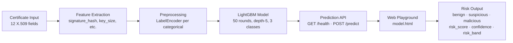

# TrustedChain — System Architecture

## Overview

TrustedChain is a single-server Python application. All components run in one process (or optionally delegate inference to a remote Flask server). The architecture is intentionally lightweight to run on a single CPU machine with sub-10 ms inference latency.

---

## Component Diagram

```
┌─────────────────────────────────────────────────────────────────────┐
│                        Client Layer                                  │
│   Browser (index.html, model.html, ml.html, admin.html)             │
│   CLI (curl, python scripts)                                         │
└────────────────────────┬────────────────────────────────────────────┘
                         │ HTTP
                         ▼
┌─────────────────────────────────────────────────────────────────────┐
│                  server.py  — ThreadingHTTPServer                    │
│                                                                      │
│  GET  /health           → liveness check (no auth)                  │
│  GET  /version          → capability metadata (no auth)             │
│  POST /api/login        → returns session token                     │
│  POST /api/predict      → certificate classification ────────┐      │
│  GET  /api/models       → available models list              │      │
│  POST /api/upload       → quarantined sample upload           │      │
│  GET  /api/admin/overview → telemetry dashboard              │      │
│  GET  /                 → static file server                  │      │
└──────────────────────────────────────────────────────────────┼──────┘
                                                               │
                    ┌──────────────────────────────────────────┘
                    │  (if TRUSTCHAIN_REMOTE_PREDICT_URL set)
                    ▼                       ▼
         ┌─────────────────┐     ┌──────────────────────────────────┐
         │  Remote Flask   │     │  Local Inference (same process)  │
         │  predict_server │     │                                  │
         │  :5000 /predict │     │  models/lightgbm_fast.joblib     │
         └─────────────────┘     │  models/feature_encoders.joblib  │
                                 │  models/label_map.joblib         │
                                 └──────────────────────────────────┘
```

---

## Mermaid Architecture Diagram



---

## Data Flow — Prediction Request

```
1. Client submits POST /api/predict with JSON features
2. server.py validates auth (Basic or X-API-Token header)
3. server.py checks REMOTE_PREDICT_URL:
   a. If set → forwards request to predict_server.py
   b. If not set → runs local inference
4. Feature row is built (12 columns, missing fields → defaults)
5. Categorical features encoded via LabelEncoder (trained on 5M dataset)
6. pandas DataFrame created and types coerced to float
7. LightGBM model.predict() returns (1, 3) probability matrix
8. pred_id = argmax of probability vector
9. risk_score = P(malicious), confidence = max(P), risk_band = high/medium/low
10. JSON response returned with prediction, probabilities, risk metrics
```

---

## Key Design Decisions

| Decision | Rationale |
|----------|-----------|
| Python stdlib `ThreadingHTTPServer` | Zero runtime dependencies for the server itself |
| LightGBM over XGBoost/sklearn GB | Same accuracy (97.3%), 4x faster training, 354 KB model |
| 12-feature subset | Covers primary attack vectors; keeps inference < 10 ms |
| `LabelEncoder` (not one-hot) | Small model size, handles high-cardinality text fields |
| In-memory token store | Simplicity for demo; swap for Redis/DB in production |
| Quarantined uploads | Files zipped with random UUID prefix, never served publicly |
| Remote inference mode | Allows GPU backend via Tailscale without frontend changes |

---

## Directory Structure

```
trustedchain/
├── server.py              # Main HTTP server (stdlib only)
├── predict_server.py      # Optional remote Flask inference server
├── train_model.py         # LightGBM training pipeline
├── requirements.txt       # Pinned Python dependencies
├── Dockerfile             # Production container image
├── docker-compose.yml     # Multi-container orchestration
├── .env.example           # Environment variable template
├── src/
│   ├── api.py             # python -m src.api entry point
│   ├── train.py           # python -m src.train entry point
│   └── evaluate.py        # python -m src.evaluate entry point
├── tests/
│   ├── test_model.py      # Model loading and prediction tests
│   ├── test_features.py   # Feature encoding tests
│   └── test_api.py        # HTTP integration tests
├── models/
│   ├── lightgbm_fast.joblib       # Trained LightGBM model (354 KB)
│   ├── feature_encoders.joblib    # Per-feature LabelEncoders (20 MB)
│   └── label_map.joblib           # {0: "benign", 1: "malicious", 2: "suspicious"}
├── data/
│   └── DATA_SAMPLE.csv    # Anonymised 16-row sample
├── machine-learning-code/
│   ├── scripts/           # Training scripts for all 8 models
│   ├── notebooks/         # Jupyter exploration notebooks
│   └── outputs/           # Metrics JSON and plots
├── docs/                  # All project documentation
└── index.html             # Web frontend (static files)
```
